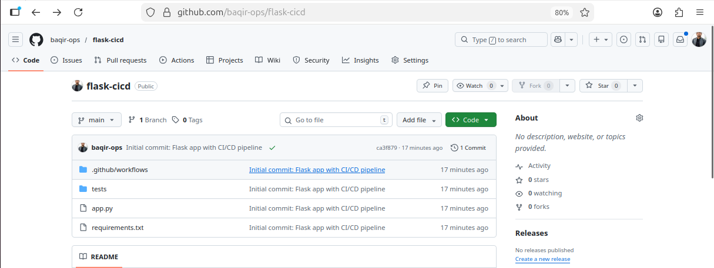
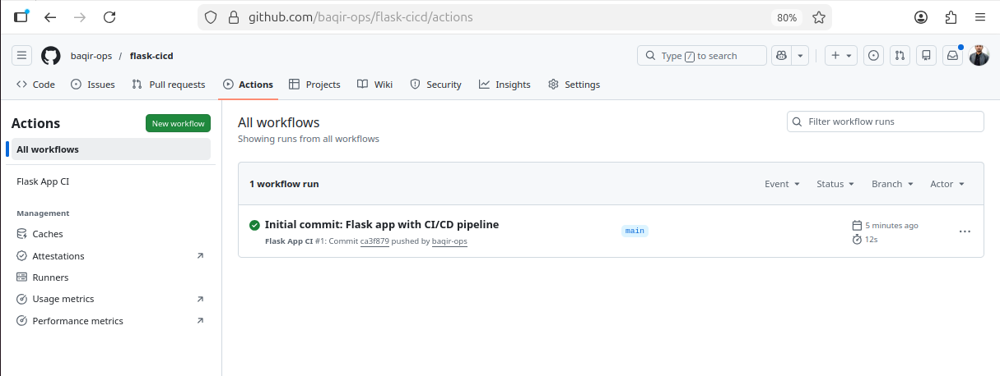
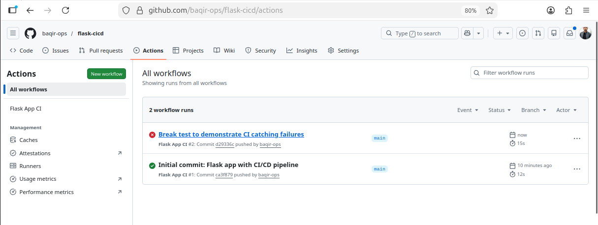
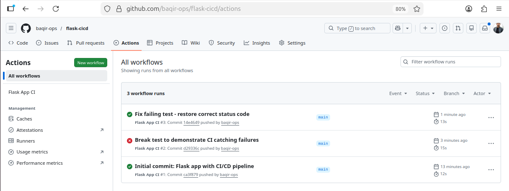
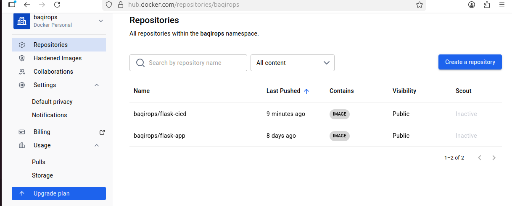
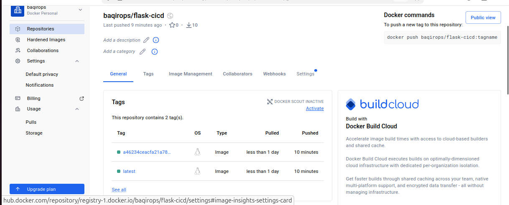

# 🚀 Flask CI/CD Pipeline


A production-ready Flask REST API with a fully automated CI/CD pipeline using GitHub Actions. Every push to `main` automatically runs tests, checks code quality, builds a Docker image and pushes to Docker Hub — **zero manual work.**

---

## 📁 Project Structure



```
flask-cicd/
├── .github/
│   └── workflows/
│       └── ci.yml          # CI/CD pipeline definition
├── tests/
│   ├── __init__.py
│   └── test_app.py         # 4 automated test cases
├── app.py                  # Flask application
├── Dockerfile              # Container definition
├── requirements.txt        # Python dependencies
└── README.md
```

---

## 🛠️ Tech Stack

| Technology | Purpose | Version |
|---|---|---|
| Python | Programming language | 3.11 |
| Flask | Web framework | 2.3.3 |
| pytest | Automated testing | 7.4.0 |
| flake8 | Code quality linting | Latest |
| GitHub Actions | CI/CD pipeline | — |
| Docker | Containerization | Latest |
| Docker Hub | Image registry | — |

---

## 🌐 API Endpoints

| Method | Endpoint | Response |
|---|---|---|
| GET | `/` | `{"message": "Hello from Baqir's Flask App!", "author": "baqir-ops", "status": "running"}` |
| GET | `/health` | `{"status": "healthy"}` |

---

## ⚙️ CI/CD Pipeline

The pipeline triggers on every `push` and `pull_request` to `main`.

### Pipeline Flow

```
git push origin main
        ↓
GitHub Actions wakes up
        ↓
┌─────────────────┐    ┌─────────────────┐
│   test job      │    │   lint job      │
│ 1. checkout     │    │ 1. checkout     │
│ 2. setup python │    │ 2. setup python │
│ 3. pip install  │    │ 3. pip install  │
│ 4. pytest -v    │    │    flake8       │
└────────┬────────┘    └────────┬────────┘
         │    run in PARALLEL   │
         └──────────┬───────────┘
                    ↓ both pass ✅
             ┌─────────────┐
             │ docker job  │
             │ 1. checkout │
             │ 2. login    │
             │ 3. build    │
             │ 4. push     │
             └──────┬──────┘
                    ↓
       hub.docker.com/r/baqirops/flask-cicd
       :latest + :commitSHA
```

**Total pipeline time: 34 seconds ⚡**

---

## 📸 Pipeline in Action

### ✅ All 3 Jobs Passing — test, lint, docker


### ✅ First Pipeline Run — Green



### ❌ CI Catching a Bug — Pipeline Fails Automatically



> CI caught the broken test in 9 seconds — merge was automatically blocked. Nobody had to manually check.

### ✅ Bug Fixed — Pipeline Green Again



---

## 🐳 Docker Hub — Auto-pushed by CI/CD

### Repositories on Docker Hub



### Two Tags — Latest + Commit SHA



> Every successful pipeline push creates two tags:
> - `:latest` → always points to newest image
> - `:commitSHA` → permanent reference for rollback

---

## 💻 Run Locally

```bash
# Clone the repository
git clone https://github.com/baqir-ops/flask-cicd.git
cd flask-cicd

# Install dependencies
pip install -r requirements.txt

# Run the Flask app
python app.py
# → http://localhost:5000

# Run tests
pytest tests/ -v

# Run linting
flake8 app.py --max-line-length=100
```

---

## 🐳 Run with Docker

```bash
docker pull baqirops/flask-cicd:latest
docker run -p 5000:5000 baqirops/flask-cicd:latest
# → http://localhost:5000
```

---

## 📊 What I Learned Building This

- Setting up GitHub Actions CI/CD pipeline from scratch
- Writing pytest test cases for Flask REST endpoints
- Running parallel jobs — test + lint simultaneously
- Using GitHub Secrets to protect Docker Hub credentials
- Auto-building and pushing Docker images on every commit
- Image tagging — `:latest` vs commit SHA for rollback
- Debugging real pipeline failures and fixing them live

---

## 👤 Author

**Muhammad Baqir Nawaz**
- GitHub: [@baqir-ops](https://github.com/baqir-ops)
- Docker Hub: [baqirops](https://hub.docker.com/u/baqirops)

---

*Part of a structured DevOps learning journey — Git → CI/CD → Docker → Kubernetes → Terraform*
